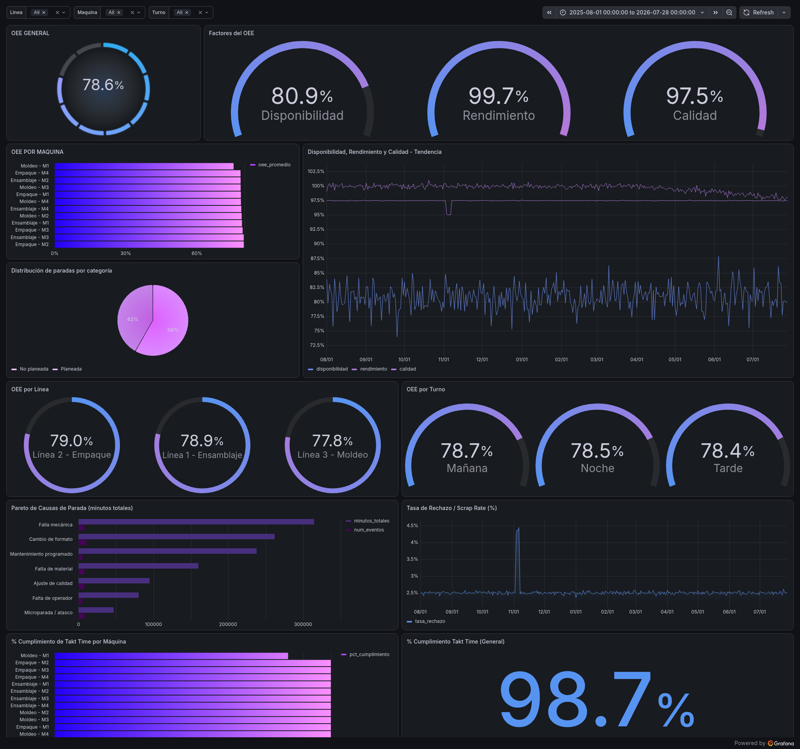

# OEE Manufacturing Dashboard

An end-to-end manufacturing analytics pipeline that simulates realistic factory data, calculates Overall Equipment Effectiveness (OEE), and visualizes it through an interactive dashboard — built as a portfolio project for MES Consultant and Manufacturing Data Analyst roles.



**[Live Grafana Dashboard →](https://lankyprotea283.grafana.net/public-dashboards/7e4d422c3e164dbca87f7c7b7b366e31)**

> Note: Grafana's public dashboard sharing does not currently support template variables (a known platform limitation), so the interactive line/machine/shift filters shown in the screenshot above are not available in the public link. The screenshot reflects the full dashboard experience as seen when signed in.

---

## Overview

This project simulates 12 months of production data across 3 lines and 12 machines, calculates OEE (Availability × Performance × Quality), and exposes the results through both a Grafana Cloud dashboard and a REST API.

Three intentional anomalies were designed into the data to demonstrate different types of production issues:
- **Major equipment failure** — a 5-day breakdown event on one machine (highly visible)
- **Quality incident** — a defective material batch causing a rejection spike on one line (visible, dated event)
- **Gradual degradation** — a subtle, progressive performance decline on one machine due to lack of maintenance (only detectable through trend analysis, not a single event)

## Tech Stack

| Layer | Technology |
|---|---|
| Data simulation & calculations | Python (pandas, numpy) |
| Database | PostgreSQL (local dev) + Neon (cloud, production) |
| Visualization | Grafana Cloud |
| API | FastAPI |
| Version control | Git / GitHub |

## Architecture

```
Python simulation → PostgreSQL/Neon (star schema) → Grafana Cloud (dashboard)
                                                    → FastAPI (REST endpoints)
```

### Data model (star schema)

- **Dimensions**: `lineas` (lines), `maquinas` (machines), `turnos` (shifts), `causas_parada` (downtime causes)
- **Facts (event-level)**: `produccion_intervalos` (production, ~20-min intervals), `paradas` (downtime events)
- **Facts (aggregated)**: `oee_turno` (OEE calculated per machine/shift/day), `takt_jph` (Takt Time & JPH per machine/day)

See [`diagrams/erd.svg`](diagrams/erd.svg) for the full entity-relationship diagram.

## Key Metrics Calculated

- **OEE** and its three independent factors: Availability, Performance, Quality
- **Takt Time & JPH (Jobs Per Hour)** — target production rate vs. actual, used to identify bottleneck machines
- **Downtime Pareto analysis** — ranks failure causes by total time impact, not just frequency
- **Scrap rate / rejection trend**

## Dashboard Features

- OEE breakdown by machine, line, and shift
- Historical trend of Availability / Performance / Quality
- Downtime Pareto chart
- Interactive filters (line, machine, shift) applied across all panels
- Threshold-based alerting when OEE drops below target

## REST API

A lightweight FastAPI service exposes the same data programmatically, with auto-generated interactive documentation (Swagger UI).

```bash
pip install fastapi uvicorn sqlalchemy psycopg2-binary python-dotenv
uvicorn api:app --reload
# then open http://127.0.0.1:8000/docs
```

| Endpoint | Description |
|---|---|
| `GET /oee/general` | Overall OEE and its 3 factors |
| `GET /oee/por-maquina` | OEE ranked by machine |
| `GET /oee/tendencia` | Daily OEE trend over a date range |
| `GET /paradas/pareto` | Downtime causes ranked by total impact |
| `GET /takt-jph/cuellos-de-botella` | Machines failing to meet their Takt Time target |

## Running Locally

```bash
# 1. Clone the repo
git clone https://github.com/mcamilamanrique98-hash/oee-manufacturing-dashboard.git
cd oee-manufacturing-dashboard

# 2. Set up a virtual environment
python -m venv venv
venv\Scripts\activate      # Windows
pip install -r requirements.txt   # (or install packages listed in each script's docstring)

# 3. Set up PostgreSQL and load the schema
psql -U postgres -d oee_dashboard -f sql/schema.sql

# 4. Run the full pipeline (simulates data + loads it to the database)
cd src
python cargar_a_postgres.py

# 5. (Optional) Run the API
uvicorn api:app --reload
```

## Design Notes & Known Limitations

- Machines within a line are modeled as producing **independently** (parallel workstations), not as a sequential assembly flow. In a real sequential assembly line — like a Gigafactory body shop — Takt Time is shared across the whole line, and a delay at one station blocks every station behind it. Modeling that kind of dependency would require discrete-event simulation (e.g., FlexSim), which is a natural next step beyond this project's current scope.
- Takt Time targets are derived from a utilization factor (85%) applied to each machine's theoretical capacity, since no real customer demand data was available to simulate against.

## Project Structure

```
oee-dashboard/
├── sql/
│   └── schema.sql              # Full DDL — star schema with indexes
├── src/
│   ├── config.py                # Central configuration (scale, dates, anomalies)
│   ├── generar_dimensiones.py   # Dimension tables (lines, machines, shifts, causes)
│   ├── simular_paradas.py       # Downtime event simulation
│   ├── simular_produccion.py    # Production interval simulation
│   ├── calcular_oee.py          # OEE calculation (Availability × Performance × Quality)
│   ├── calcular_takt_jph.py     # Takt Time / JPH calculation
│   ├── cargar_a_postgres.py     # Full pipeline → local PostgreSQL
│   ├── cargar_a_neon.py         # Full pipeline → Neon (cloud)
│   └── api.py                   # FastAPI REST service
└── diagrams/
    └── erd.svg                  # Entity-relationship diagram
```

## Author

Camila Manrique — built as part of a portfolio targeting Manufacturing Data Analyst / MES Consultant / Factory Intelligence roles.
